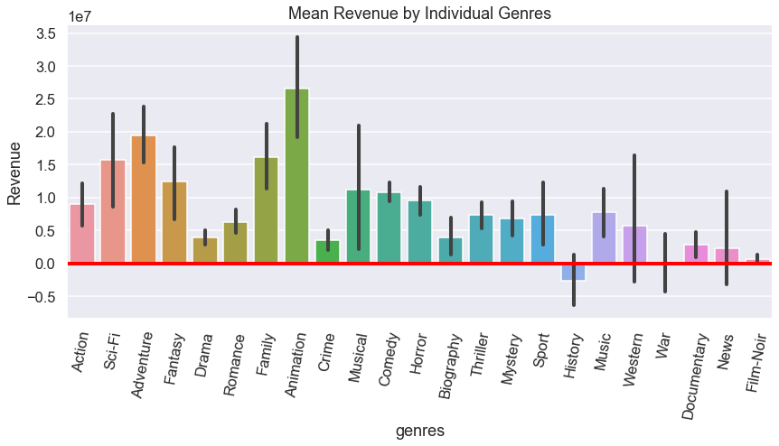
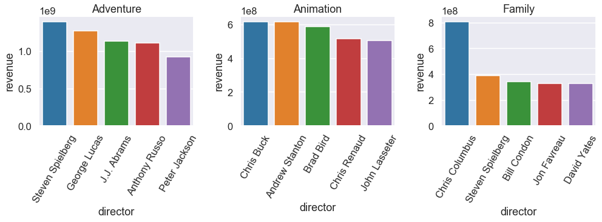
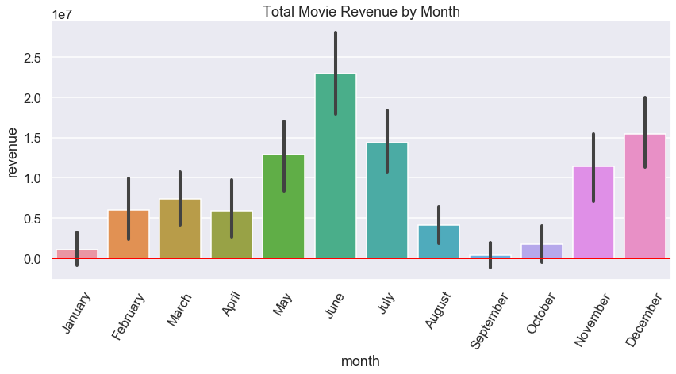
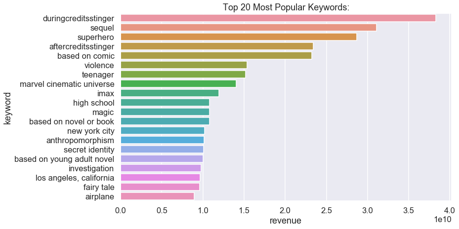

# Movie Production for Large Business
==============================

This project was created to advise new and emerging movie studios on the key insights required to release succesful movies. Although far from definitive, the insights below are enough to ensure a high revenue generating title or franchise of titles.

[Click here for online non-technical presentation](https://spark.adobe.com/page/aYgVAoMjU9YMa/)

The data was gathered from a variety of sources including:
- [IMDB's public datasets](https://www.imdb.com/interfaces/)
- [IMDB Pro's list of movies with revenue](https://pro.imdb.com/)
- [TheMovieDB.org public API](https://developers.themoviedb.org/3/getting-started/introduction)

## Project Outline
------------

    ├── LICENSE
    ├── README.md                  <- The project layout (this file)
    ├── data
    │   ├── images                 <- For README.md and presentation
    │   ├── external               <- Data from imdbpro
    │   ├── interim                <- Intermediate data that has been transformed
    │   ├── processed              <- The final, canonical data sets for analysis
    │   └── raw                    <- The original, immutable data dump
    │
    ├── notebooks                  <- Jupyter notebooks
    │   └── data_obtaining.ipynb   <- Process for obtaining desired data points
    │   └── data_scrubbing.ipynb   <- Process for cleaning the data
    │   └── eda.ipynb              <- Process for exploring and analyzing the data
    │
    ├── reports                    <- Reports and presentations
    │   └── presentation.pdf       <- Non-technical presentation
    │   └── blog.md                <- Blog post
    │   └── video_walkthrough      <- Link to video walkthrough
    │
    ├── requirements.txt           <- The requirements file for reproducing the analysis environment
    │
    └── src                        <- Source code for use in this project.
        ├── __init__.py            <- Makes src a Python module
        │
        └── data                   <- Scripts to download or generate data
            └── keyword_builder    <- node.js program to query API and save results in mongodb

--------

## Recommendations
------------
There are several recommendations that can be extracted from the data analysis, for the best results combine these all together and watch the money flow in:

1. <b>Genre</b>: When it comes to deciding the correct genres to focus on, you will be most succesful if you choose to combine: 'Animation' (which is more a medium than a genre, which give you a lot of freedom for implementing), 'Adventure', and 'Family'. 

2. <b>Director</b>: When choosing the director for your films, it's important to identify which genre you will be focusing on first. Directors tend to have a specific style, and those styles seem best suited to specific genres.
    - If you are focusing on 'Animation, Adventure, and Family' genres like I recommended in the previous step, then you will want to hire either Steven Spielberg, Chris Buck, or Chris Columbus. They each are masters of their individual genres, and have had incredibly succesful careers.
    - If you are focusing on 'War, Documentary' then you are doing it wrong and didn't take my advice from before. Go back and read step 1.

3. <b>Release Date</b>: Release date is very important. Overall June is the highest grossing month for movies, though it does change depending on which genre you chose. Since you are focusing on 'Animation, Adventure, and Family' as the genres, like I recommended, then June is indeed the best month to release the finished movie.
    - If you choose different genres, for example you choose to focus on 'Fantasy' instead of 'Family', your best month to realease will be in May. Just be aware that the ideal month does change depending on the genres.

4. <b>Content</b>: Now I will tell you which content to include in your film to make it most succesful.
    - A superhero sequel that is based on a comic, has violence, is teenager appropriate, and has fun 'stingers' in the credits and/or after the credits.
    - However, do realize these change a bit depending on the month. For your June release date try to mix in a little 'love of ones life' and 'dual identity' for maximum reward.

## Conclusions
------------
In conclusion, if you would like the highest probability of creating a high revenue film or series of films, follow these steps:
1. Choose from the list of most popular genres
2. Choose the appropriate director for the genres you chose 
3. Release the film in the appropriate month
4. Add in elements matching the top keywords

